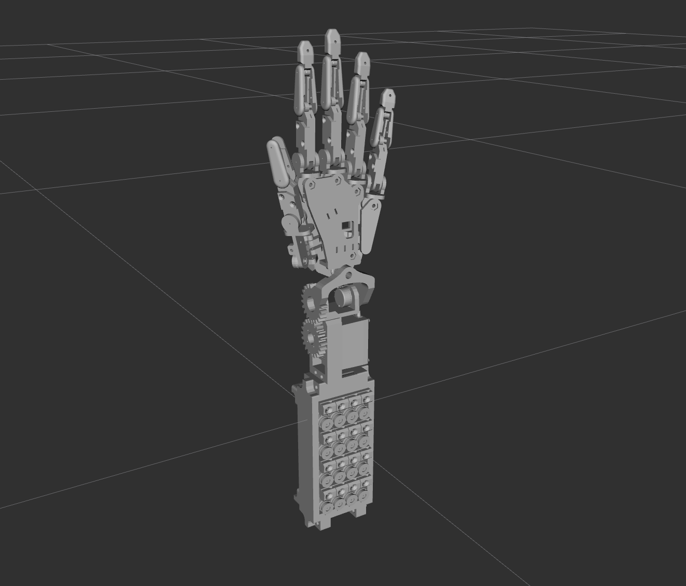

# a robot?



### Setup .bashrc
```bash

alias goros='conda deactivate 2>/dev/null; \
unset PYTHONPATH; \
source /opt/ros/kilted/setup.bash; \
cd ~/ros2_ws; \
'
alias buildros=' \
colcon build --symlink; \
source install/local_setup.bash; \
'

```

### Launch viewer
```bash

# launches robot_state_publisher, joint_state_publisher_gui
ros2 launch hand_description publish_state.launch.py 

# launches rviz, robot_state_publisher, joint_state_publisher_gui
ros2 launch hand_description view_in_rviz.launch.py

```
